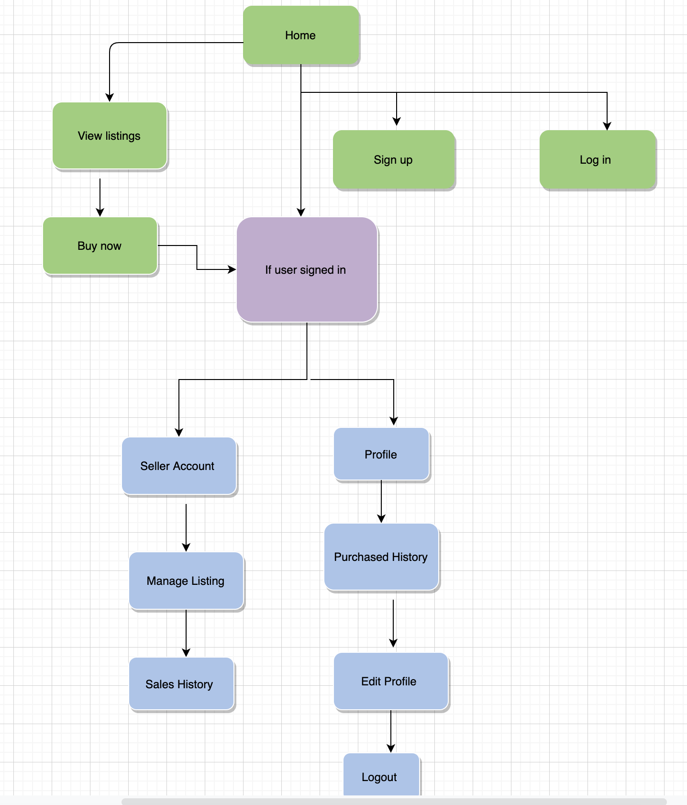
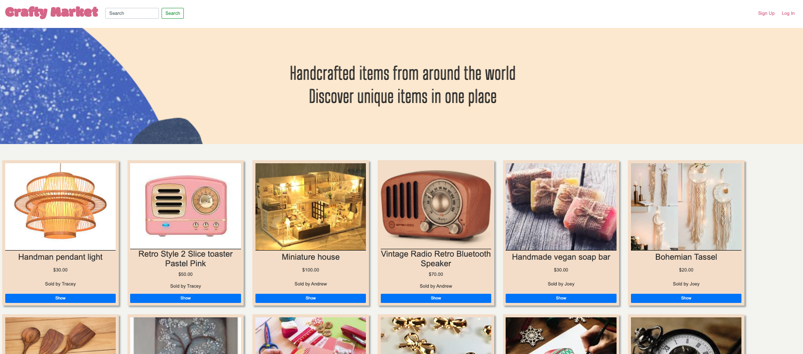
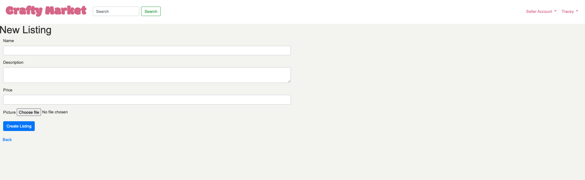
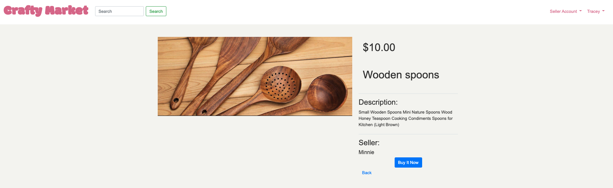
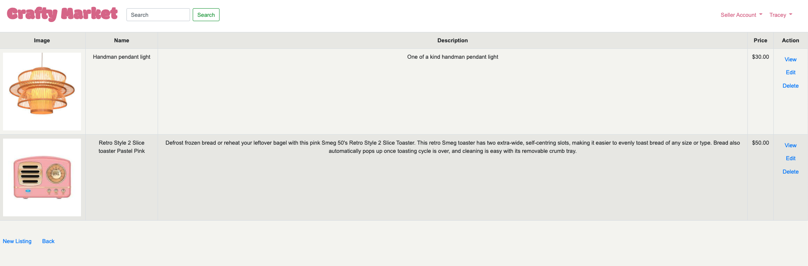
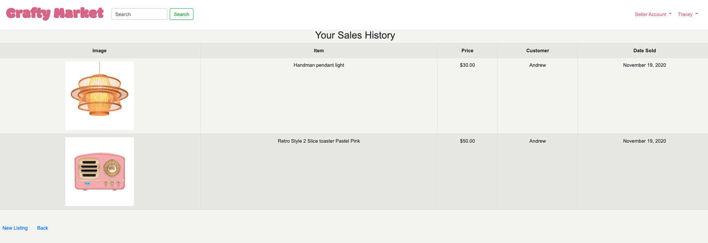
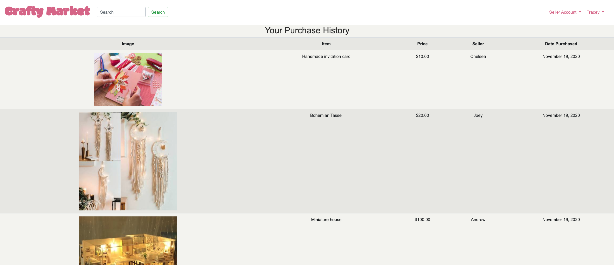
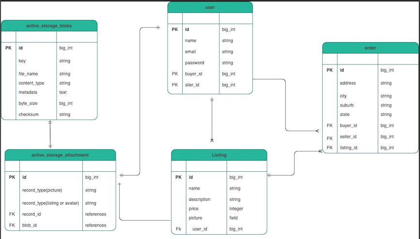

## **T2A2 - Marketplace Project - Crafty Market**

### **R7 | The Problem**:

Crafty Market is an online marketplace where people come together to buy and sell their creations and allows consumers the opportunity to admire, purchase and find inspiration from a  wide variety of homemade items.

 Currently, in the market, there is Ety known for focusing on handmade vintage items and craft supplies, but the downside is their high fees. 
 
 Etsy fees include once an item sells, there is a 5% transaction fee on the sale price. If you accept payments through Etsy Payments, they will also collect a 3-4% + AU$0.25 payment processing fee when an item is sold.
Whilst the fees are generally lower if you sell in bulk but for someone that create a few items its consider quite high and there won't be any return on investment to the seller. 

#

### **R8 | The Solution**:

Crafty Market is a  marketplace that focuses on allowing the seller to sell their creations without any fees. 
There are no processing fees as buyer and seller can exchange details for organising method of payment outside of the website. 

Crafty  Market wants to encourage people to share their creative ideas and place for people to get some exposure.
 It’s not uncommon for sellers to start on Crafty Market then grow their brand and create a website. The seller can drive traffic from Crafty marketplace listings to their website where customers get an even better taste of what they have to offer.
#

### **R9 | Deployed Website Application**:

https://crafty-market.herokuapp.com/

#

### **R10 | Github Repo**:

https://github.com/Trac3yTran/crafty_market

#
### **R11 | Crafty Market Overview**:

**Purpose**:

 The purpose of this application is to provide a central market place for
focused on handmade or vintage items and craft supplies without fees on sale and processing fees. 

**Functionality & features**:

**Accounts:**
 Users can create accounts for full site functionality and must be logged in to make any purchases or create listings. Site users that are not logged in have access to the home page and all listings however they cannot click into a listing and are prompted to create an account. Users with accounts also have the option to set up an account profile with further information about them.

**User Dashboard:**  
Once the user has created their account there will have access to the dashboard that includes Seller Account that will give them access to Manage all their listing in one spot and also the Sales History if anyone has purchased their items. On the User Account, it will give them access to Purchased History display all the purchased items here and option to Edit Profile and Sign out. 

**Listings:** All logged-in users can create listings to sell the product, including image upload. Logged in users can access details of their listings from one page, and only listing owners can edit and delete listings. 

**Search:** Users can search for a listing by name, and it will return the result if there is an existing listing that matches with what they are searching. 

**Sitemap**: 

 **Screenshots**:

 Homepage & Listing Page 

Create listing

Show listing

Seller Account (Manage Listing)

Seller Account (Sales History)

Purchased History 

 **Target audience**: 
 
 The target audience for this application is for anyone that wants to sell their creative items; this can be anything from material to make items or handmade products. Prices are listed in AUD; however, the audience is not restricted to Australia.

 **Tech stack**:

 Front-end: HTML5, CSS3, SCSS, Embedded Ruby, Bootstrap
 
Back-end: Ruby on Rails 5.2.4.

Database: Postgresql

Deployment: Heroku

Biz Tools: Trello

Utilities: Devise, AWS S3

DevOps: Git, Github, VS Code, Bundler, Balsamiq

 #

 ### **R12 | User Stories**

 # 

Crafty Market allows user profile to be set between buyer and seller. This will give each user the ability to create a listing and view listing. User stories will be broken down by the into different functionality between buyers and sellers.  

**User Access Management**:

- As a visitor, I can explore all the listing without logging in
- As a visitor, I want to be able to create an account and become a buyer and seller member. 
- As a buyer and seller, I want to be able to use my email and password to log in. 
- As a buyer or seller, I want to be able to logout of my account any time.
- As a buyer or seller, I want to delete my account anytime. 

**Listings:**

- As a buyer, I want to purchase a listing item.
- As a buyer, I want to see my purchase history
- As a seller, I want to create a post to sell my listing
- As a seller, I can upload a name, description, price and photo of my listing products to sell it.
- As a seller, I want to edit and delete my listing to reflect the correct information. 
- As a seller, I want to view my listing and one place to keep track of what I am selling
- As a seller, I want to see my listing in one page so I can manage all listing
- As a seller, I want to see my sales history to see who has purchased my item. 

**Authentication & Authorisation**:

- As a buyer or seller, I do not want others to be able to access my order and to keep my details safe
- As a seller, I do not want others to edit and delete my posts

#
 ### **R13 | Wireframes**:

 #

 ### **R14 | ERD**:

#

 ### **R15 | High-level components**:

 #

 ### **R16 | 3rd Party Services**:

**Devise:** The Devise Gem is users for User Authentication. It creates sign-up and sign-in forms; it also can be used to create user accounts for privacy.

**Amazon S3:**  Facilitates image upload and provides object storage through a web service interface.

**Bootstrap Framework:** The Bootstrap framework has been used with CSS to style buttons, forms and overall aesthetic of the application. 

**Heroku:** For deployment for the application and operates the application entirely in the cloud.

 #

 ### **R17 | Models**: 

 #

 ### **R18 | Database Relations**:

 #

 ### **R19 | Database Schema Design**:

 #

 ### **R20 | Task Management**:

